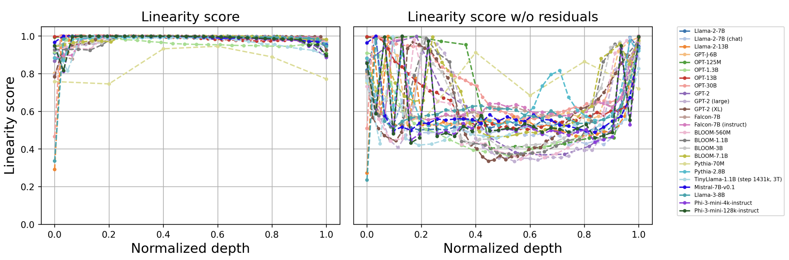

# Your Transformer is Secretly Linear

This repository contains the official implementation of the code for the paper [Your Transformer is Secretly Linear](https://arxiv.org/abs/2405.12250).



We've also created a pip package containing the functions from [notebook](https://github.com/AIRI-Institute/LLM-Microscope/blob/main/LLM_microscope.ipynb).

Use ```pip install llm- ``` to install it.

### Example

```python
import torch
from llm_microscope import  (
  calculate_anisotropy_torch,
  intrinsic_dimension,
  procrustes_similarity,
  procrustes_similarity_centered
)

device = 'cpu'

X = torch.randn((1000, 10)) # pseudo-random "features", 1000 vectors with dim=10.
Y = torch.randn((1000, 10)) # pseudo-random "features", 1000 vectors with dim=10.

anisotropy = calculate_anisotropy_torch(X) # anisotropy score
int_dim = intrinsic_dimension(X, device) # intrinsic dimension
linearity_score = procrustes_similarity(X, Y) # linearity score from tha paper
centered_linearity_score = procrustes_similarity_centered(X, Y) # the same as linearity between X and Y - X
```
